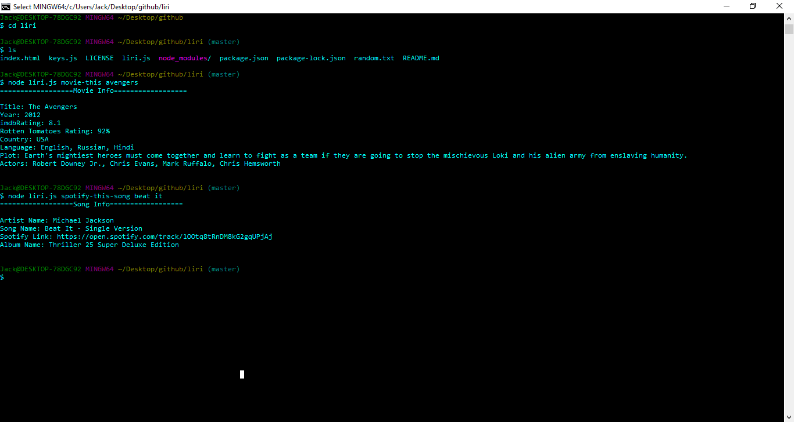

# Liri
Liri is a little helper accessed through the terminal. She will return you data for movies, concerts and songs of your asking. 

## Getting Started 
you  need to install axios, dotenv, moment, and node-spotify-api in order to use Liri. 

## How to use 

In order to call on liri, run the file "liri.js" through node followed by one of the following commands.  
* "concert-this"  
* "spotify-this-song"  
* "movie-this"  
* "do-what-it-says"  

Type the object that you would like to search up following the command and press enter.  
Liri will then return to you data about the object you searched up!  

## Built With

* node.js
* Javascript
